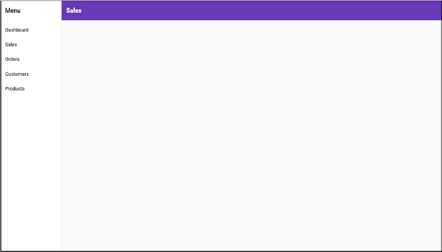
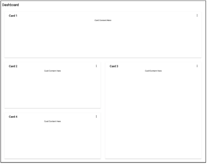
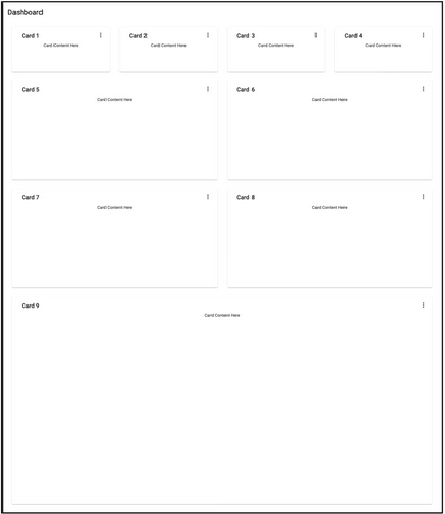
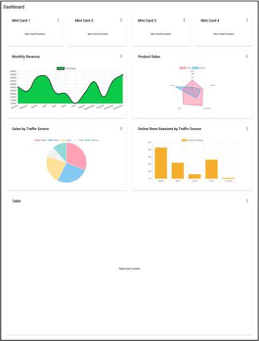
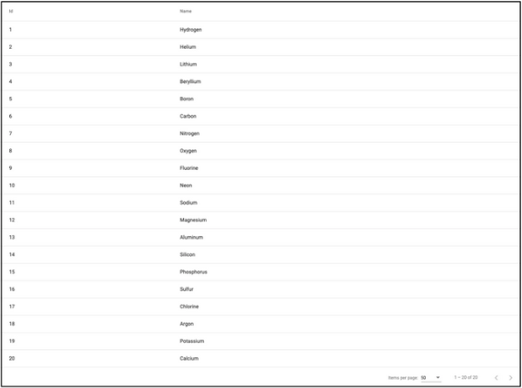
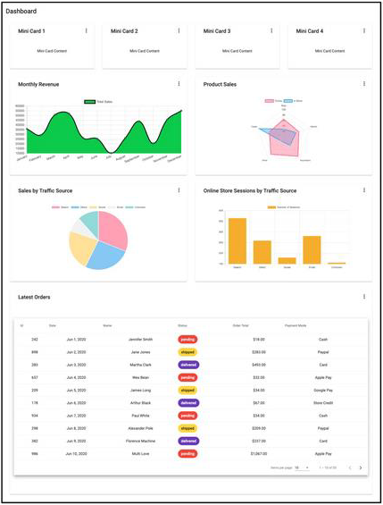
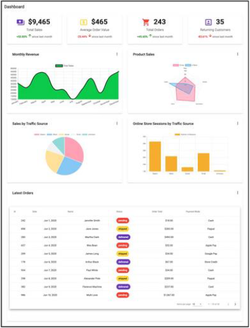
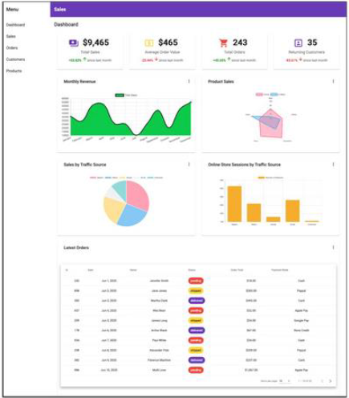

# ProjetoVendas

For run project install:
@angular/materal
ng2-charts
json-server
<hr>
command for run project:
<p>>npm start</p>
<p>>json-server --watch src/api/db.json</p>

<hr>

# Store Admin Panel
## Pré-requisitos
Para acompanhar, você precisará ter o Angular CLI instalado. Se você não o tiver instalado, poderá descobrir
como obtê-lo em [cli.angular.io](https://angular-io.translate.goog/cli?_x_tr_sl=en&_x_tr_tl=pt&_x_tr_hl=pt-PT&_x_tr_pto=op,sc) . Se você não estiver começando a partir de um projeto Angular pré-existente,
precisará gerar um executando ```ng new <your project name>```. Por exemplo, para criar um painel de
administração para a loja mencionada, executaremos:

```ng new store-admin-panel```

Seu projeto também precisa ter rotas configuradas para ele. Se você estiver começando a partir de um novo
aplicativo, selecione __SIM__ quando solicitado a adicionar um módulo de roteamento angular durante a
configuração do projeto acima.

## Adicione material angular e gráficos Ng2 ao seu projeto
O Angular Material é fornecido com vários esquemas para gerar uma variedade de componentes úteis, como
catálogos de endereços, árvores, tabelas, navegação e assim por diante. Para adicionar Angular Material ao seu
projeto, execute:

```ng add @angular/material```

Escolha um tema entre as opções fornecidas nos prompts subsequentes. Em seguida, você será solicitado a
escolher se deseja adicionar estilos de tipografia Angular Material e animações do navegador. Você não precisa
disso e pode simplesmente responder não.

Em seguida, você precisará instalar ng2-charts. ng2-charts requer charts.js como uma dependência. Para
instalar ng2-charts, execute:

```npm install ng2-charts --save```

### Em seguida, instale charts.js:

```npm install chart.js --save```

### Para acessar os gráficos, adicione ChartsModuleo AppModule's imports.

```
import { ChartsModule } from 'ng2-charts';
@NgModule({
    imports: [
    ...
    ChartsModule,
    ...
]
})
```
### Por fim, instale os esquemas ng2-charts como uma dependência dev porque eles não são fornecidos com ng2-charts por padrão.

```npm install --save-dev ng2-charts-schematics```

## Gerando um componente de navegação ##

Primeiro, precisaremos adicionar um componente de navegação para ajudar os usuários a navegar
confortavelmente pelo aplicativo. A navegação deve conter links para o painel e outras páginas que farão parte
do painel de administração. O material angular fornece um esquema que gera um componente de navegação.
Vamos nomear este componente _NAV_. A adição de uma navegação lateral ao aplicativo é realizada executando:

```ng generate @angular/material:navigation nav```

Para vincular outras rotas na navegação, use a __routerLink__ diretiva e altere o nome da página na barra de
ferramentas dependendo de qual rota o usuário está.
```
// nav.component.ts
...
menuItems = ['dashboard', ’sales', 'orders', 'customers', 'products'];
<!--nav.component.html-->
...
<mat-nav-list>
<a *ngFor="let item of menuItems" mat-list-item [routerLink]="'/'+item"> {{item |
titlecase}} </a>
...
```

Para ver este componente, adicione-o a app.component.html.
```
<!--app.component.html-->
<app-nav></app-nav>
```
### Isto é o que NavComponent parece. ###


Como o nav será exibido ao lado de outros componentes, adicionar um __router-outleta__ ele ajudaria a alternar
entre os outros componentes diferentes. No __nav.component.html__, logo após o fechamento ```</mat-
toolbar>```, substitua o ```<!-- Add Content Here -->``` comentário por ```<router-outlet></router-outlet>```.
```
<!--nav.component.html-->
<mat-sidenav-container>
    ...
    <mat-sidenav-content>
        <mat-toolbar>
            ...
        </mat-toolbar>
        <router-outlet></router-outlet>
    </mat-sidenav-content>
</mat-sidenav-container>
```
Nas capturas de tela a seguir neste artigo, esse componente de navegação será omitido para destacar melhor o
painel que geraremos para o tutorial. Se você estiver acompanhando enquanto cria este painel, a navegação
ainda aparecerá como mostrado acima em seu navegador com o painel dentro dele.

## Gerar o painel ##

A parte mais importante do painel é o seu layout. Ele precisa conter todos os componentes mencionados
anteriormente e ser responsivo quando exibido em diferentes dispositivos. Para gerar o layout do painel, você
precisará executar o __@angular/material:dashboardesquema__. Ele irá gerar um componente de painel
responsivo. Passe o nome preferido do seu painel para o esquema. Neste caso, vamos nomeá-lo __dash__.

```ng generate @angular/material:dashboard dash```

### Para visualizar o painel recém-gerado no componente nav, adicione uma rota para ele no roteador. ###
```
// app-routing.module.ts
import { DashComponent } from './dash/dash.component';

const routes: Routes = [{ path: 'dashboard', component: 
DashComponent }];

@NgModule({
    imports: [RouterModule.forRoot(routes)],
    exports: [RouterModule]
})
```
Feito isso, para ver os resultados, corra _npm start_ e vá até o _localhost:4200/dashboard_. Você deve ver isso:


O esquema gera quatro cartões no modelo e os exibe em uma grade responsiva. O Angular Material CDK usa o
_Layout_ pacote para estilizar essa grade de cartão responsiva. O _BreakpointObserver_ utilitário do _Layout_
pacote avalia consultas de mídia e faz alterações na interface do usuário com base nelas. Existem vários pontos
de interrupção disponíveis, mas dentro do componente gerado, apenas duas categorias são atendidas. A
_Breakpoints.Handsete_ outras consultas que não correspondem a ela. O _Layout_ pacote especifica [14 estados
de ponto de interrupção](https://material-angular-io.translate.goog/cdk/layout/api?_x_tr_sl=en&_x_tr_tl=pt&_x_tr_hl=pt-PT&_x_tr_pto=op,sc) que você pode usar para personalizar a capacidade de resposta do seu painel.
```
// dashboard.component.js
...
cards = this.breakpointObserver.observe(Breakpoints. Handset).pipe(
    map(({ matches }) => {
        if (matches) {
            ...
        }
        ...
    })
);
```
Voltando ao painel, já que quatro cartões de resumo, quatro gráficos e uma tabela estarão no painel, precisamos
de nove cartões no total. _Breakpoints.Handset_ e _Breakpoints.Tabletas_ correspondências serão exibidas
em uma grade de uma coluna onde:

* Os quatro cartões de resumo ocuparão uma linha.
* Os gráficos abrangerão duas linhas.
* A tabela abrangerá quatro linhas.

Não -correspondências _Breakpoints.Handset_ e não- _Breakpoints.Tablet_ correspondências serão exibidas
em quatro colunas onde:

* Os quatro cartões de resumo abrangerão uma linha e uma coluna.
* Os gráficos abrangerão duas linhas e duas colunas.
* A tabela abrangerá quatro linhas e quatro colunas.

Deve ser algo como a captura de tela abaixo em não _Breakpoints.Handset_ e não _Breakpoints.Tablet_
correspondências. On _Breakpoints.Handsetand_ _Breakpoints.Tabletmatches_, tudo será exibido apenas em
uma coluna.


## Criar um componente de cartão ##
No componente dashboard, todos os cartões são gerados por meio de iteração. Para evitar repetições, ao
adicionar todos os novos componentes, criaremos um componente de cartão reutilizável. O componente do
cartão aceitará um título como entrada e usará _ng-content_ para adicionar dinamicamente o restante do
conteúdo. Para criar o componente do cartão, execute:

```ng g c card -m app --style css```

No modelo de componente do painel, pegaremos a marcação incluída na ```<mat-card>``` tag e a colocaremos no
modelo de cartão:
```
<!--card.component.html-->
<mat-card class="dashboard-card">
    <mat-card-header>
        <mat-card-title>
            {{title}}
            <button mat-icon-button class="more-button" [matMenuTriggerFor]="menu" aria-
label="Toggle menu">
                <mat-icon>more_vert</mat-icon>
            </button>
            <mat-menu #menu="matMenu" xPosition="before">
                <button mat-menu-item>Expand</button>
                <button mat-menu-item>Remove</button>
            </mat-menu>
        </mat-card-title>
    </mat-card-header>
    <mat-card-content class="dashboard-card-content">
        <ng-content></ng-content>
    </mat-card-content>
</mat-card>
```
### Para adicionar o título como entrada ao cartão: ###
```
// card.component.ts
import { Component, Input } from '@angular/core';
...
export class CardComponent{
    @Input() title: string;
...
}
```
### Para estilizar o cartão: ###
```
/*card.component.css*/
.more-button {
    position: absolute;
    top: 5px;
    right: 10px;
}

.dashboard-card {
    position: absolute;
    top: 15px;
    left: 15px;
    right: 15px;
    bottom: 15px;
}

.dashboard-card-content {
    text-align: center;
    flex-grow: 1;
    display: flex;
    flex-direction: column;
    align-items: center;
    max-height: 100%;
    justify-content: center;
    align-items: stretch;
}

mat-card {
    display: flex;
    flex-direction: column;
}
```

## Adicionando cartões ao painel ##

Como os elementos do painel serão adicionados individualmente e não por meio de iteração, o componente do
painel precisa ser modificado para levar em conta isso. Em _dashboard.component.ts_, remova a
_cards_ propriedade e substitua-a por uma _cardLayout_ propriedade. A _cardLayout_ variável definirá o número de
colunas para a lista de grade de materiais e quantas linhas e colunas cada um dos cartões do painel abrangerá.
_Breakpoints.Handsete_ _Breakpoints.Tabletas_ correspondências de consulta serão exibidas em 1 coluna e as
que não corresponderem serão exibidas em 4 colunas.
```
// dashboard.component.js
...
cardLayout = this.breakpointObserver.observe(Breakpoints.Handset).pipe(
    map(({ matches }) => {
        if (matches) {
            return {
                columns: 1,
                miniCard: { cols: 1, rows: 1 },
                chart: { cols: 1, rows: 2 },
                table: { cols: 1, rows: 4 },
            };
        }
            return {
                columns: 4,
                miniCard: { cols: 1, rows: 1 },
                chart: { cols: 2, rows: 2 },
                table: { cols: 4, rows: 4 },
            };
        })
    );
...
```

No _dash.component.html_ modelo, substitua os valores _colspan_ e dos elementos e a propriedade do
_elemento.rowspan_ _mat-grid-tilecols mat-grid-list_
```
<!--dash.component.html-->
<div class="grid-container">
    <h1 class="mat-h1">Dashboard</h1>
    <mat-grid-list cols="{{ ( cardLayout | async )?.columns }}" rowHeight="200px">
        <!--Mini Cards-->
        <mat-grid-tile *ngFor="let i of [1, 2, 3, 4]" [colspan]="( cardLayout | async
)?.miniCard.cols"
        [rowspan]="( cardLayout | async )?.miniCard.rows">
        <app-card title="Card {{i}}"><div>Mini Card Content Here</div></app-card>
    </mat-grid-tile>
    <!--Charts-->
    <mat-grid-tile *ngFor="let i of [5, 6, 7, 8]" [colspan]="( cardLayout | async
)?.chart.cols"
        [rowspan]="( cardLayout | async )?.chart.rows">
        <app-card title="Card {{i}}"><div>Chart Content Here</div></app-card>
    </mat-grid-tile>
    <!--Table-->
    <mat-grid-tile [colspan]="( cardLayout | async )?.table.cols" [rowspan]="( cardLayout
| async )?.table.rows">
        <app-card title="Card 9"><div>Table Content Here</div></app-card>
    </mat-grid-tile>
</mat-grid-list>
</div>
```

## Gerando os gráficos ##

### Os quatro gráficos que precisamos para o painel são: ###

* Um gráfico de radar de produtos por unidade vendida.
* Um gráfico de pizza de vendas por origem de tráfego.
* Um gráfico de barras das sessões da loja online.
* Um gráfico de linhas de vendas ao longo do ano.

Semelhante à criação do painel, a geração de componentes do gráfico envolve a execução de um esquema.
Usando os esquemas ng2-charts, gere os quatro gráficos diferentes. Vamos colocá-los em uma pasta chamada
charts.

Executar ```ng generate ng2-charts-schematics:<chart type> <chart name>.```
```
ng generate ng2-charts-schematics:radar charts/product-sales-chart
ng generate ng2-charts-schematics:pie charts/sales-traffic-chart
ng generate ng2-charts-schematics:line charts/annual-sales-chart
ng generate ng2-charts-schematics:bar charts/store-sessions-chart
```
Depois de executar esses comandos, todos os quatro componentes do gráfico são gerados e preenchidos com
dados de amostra prontos para exibição. Dependendo de quais dados você gostaria de mostrar, escolha os
gráficos que mais se adequam às suas necessidades de visualização de dados. Para cada um dos gráficos
gerados acima, adicione a chartContainer classe aos div que incluem o canvas elemento nos modelos de
gráfico.
```
<div class="chartContainer">
<canvas baseChart width="400" height="400">
...
```
Em seguida, adicione esse estilo para styles.css que eles possam ser acessados por todos os componentes do
gráfico.
```
/*styles.css*/
...
.chartContainer canvas {
max-height: 250px;
width: auto;
}
.chartContainer{
height: 100%;
display: flex;
flex-direction: column;
align-items: center;
justify-content: center;
}
```

## Adicionando dados aos gráficos ##
Os componentes do gráfico gerados vêm com dados de amostra já conectados. Se você tiver serviços pré-
existentes que fornecem seus próprios dados, poderá adicionar esses dados deles aos componentes do gráfico.
Os gráficos recebem rótulos para o eixo x, dados ou conjuntos de dados, um tipo de gráfico, cores, uma legenda
e outras [opções de personalização](https://valor--software-com.translate.goog/ng2-charts/?_x_tr_sl=en&_x_tr_tl=pt&_x_tr_hl=pt-PT&_x_tr_pto=sc). Para fornecer os dados e rótulos aos gráficos, crie um serviço que buscará
dados de uma fonte de sua escolha e os retornará em um formato aceito pelos gráficos. Por exemplo, o
_AnnualSalesChartComponent_ recebe seu conjunto de dados e rótulos do método _SalesService's_
_getSalesByMonthque_ retorna uma matriz de vendas para cada mês do ano atual. Você pode [encontrar este
serviço aqui](https://gist-github-com.translate.goog/zaracooper/4fd1c430f547a247595bf91b6268120c?_x_tr_sl=en&_x_tr_tl=pt&_x_tr_hl=pt-PT&_x_tr_pto=sc) e os dados que ele retorna aqui . Injetar o serviço como propriedade privada ao
_AnnualSalesChartComponent_ construtor. Chame o método que retorna os dados do gráfico necessários do
serviço no _ngOnInit_ gancho do ciclo de vida.
```
// annual-sales-chart.component.ts
import { SalesService } from ’src/app/sales/sales.service';
...
export class AnnualSalesChartComponent implements OnInit {
    public salesChartData: ChartDataSets[] = [
        { data: [], label: 'Total Sales' },
];
public salesChartLabels: Label[] = [];
...
constructor(private salesService: SalesService) { }
ngOnInit() {
    this.salesService.getSalesByMonth().subscribe({
        next: salesItems => {
            salesItems.forEach(li => {
                this.salesChartData[0].data.push(li.revenue);
                this.salesChartLabels.push(li.month);
            });
        },
        ...
    });
    }
}
```

## Adicionando gráficos ao painel ##
A próxima etapa envolve adicionar os gráficos ao painel, no formato dash.component.html. Aqui está o que
parece:
```
<!--dash.component.html-->
...
<!--Charts-->
<mat-grid-tile [colspan]="( cardLayout | async )?.chart.cols" [rowspan]="( cardLayout |
async )?.chart.rows">
    <app-card title="Monthly Revenue">
        <app-annual-sale-chart></app-annual-sale-chart>
    </app-card>
</mat-grid-tile>
<mat-grid-tile [colspan]="( cardLayout | async )?.chart.cols" [rowspan]="( cardLayout |
async )?.chart.rows">
    <app-card title="Product Sales">
        <app-product-sales-chart></app-product-sales-chart>
    </app-card>
</mat-grid-tile>
<mat-grid-tile [colspan]="( cardLayout | async )?.chart.cols" [rowspan]="( cardLayout |
async )?.chart.rows">
    <app-card title="Sales by Traffic Source">
        <app-sales-traffic-chart></app-sales-traffic-chart>
    </app-card>
</mat-grid-tile>
<mat-grid-tile [colspan]="( cardLayout | async )?.chart.cols" [rowspan]="( cardLayout |
async )?.chart.rows">
    <app-card title="Online Store Sessions by Traffic Source">
        <app-store-sessions-chart></app-store-sessions-chart>
    </app-card>
</mat-grid-tile>
...
```
É assim que o painel responsivo resultante se parece


## Gerando uma tabela ##

Adicionaremos uma tabela de pedidos para dar ao proprietário da loja uma visão geral dos pedidos mais
recentes feitos e seu status. Para gerar o componente da tabela de pedidos, execute o esquema:

```ng generate @angular/material:table orders-table```

Isso gerará um componente de tabela que ficará assim.

Tabelas com muitas colunas podem ser difíceis de tornar responsivas para visualizações de celulares e tablets.
Ao adicionar a tabela a um cartão, torne-a rolável horizontalmente para que todos os dados possam ser
visualizados corretamente e não fiquem obstruídos. Você pode fazer isso adicionando o estilo abaixo ao seu
componente de tabela:
```
<!--table.component.html-->
<div class="mat-elevation-z8 small-table">
    <table mat-table class="full-width-table" matSort aria-label="Elements">
        ...
/*table.component.css*/

...

.small-table{
    overflow-x: scroll !important;
}
```

### Para adicionar a tabela ao componente de traço: ###
```
<!-- dashboard.component.html>
...
    <mat-grid-tile [colspan]="( cardLayout | async )?.table.cols" [rowspan]="( cardLayout |
async )?.table.rows">
        <app-card title="Latest Orders">
            <app-orders-table></app-orders-table>
        </app-card>
    </mat-grid-tile>
...
```

## Adicionando dados à tabela ##

Assim como nos gráficos, você pode adicionar dados à tabela no _ngOnInit_ método de um serviço. Além disso,
você precisará modificar a fonte de dados gerada da sua tabela para consumir dados do serviço. Para começar,
injete o serviço no construtor de classe da tabela. Vamos pegar o exemplo de uma tabela listando os pedidos
mais recentes para este painel. Para obter dados para a tabela, vamos injetar o OrderServicen o
_OrdersTableComponent_ construtor, alterar a _MatTable_ declaração de tipo do filho de exibição de tabela e
alterar a lista de colunas exibidas para refletir uma [interface de ordem](https://gist-github-com.translate.goog/zaracooper/8f2df77f4e41fb274d7ae1878a737260?_x_tr_sl=en&_x_tr_tl=pt&_x_tr_hl=pt-PT&_x_tr_pto=sc). Se estiver interessado nos dados
adicionados à tabela, você pode encontrá-los [aqui](https://gist-github-com.translate.goog/zaracooper/50b2a8736bc1268a26e97f49f0e5ba33?_x_tr_sl=en&_x_tr_tl=pt&_x_tr_hl=pt-PT&_x_tr_pto=sc). A última coisa envolve obter o comprimento total dos itens
de dados disponíveis para serem usados para definir o total no arquivo ```<mat-paginator>.```
```
// orders-table.component.ts
import { OrderService } from '../orders.service';
import { Order } from '../order';
...
export class OrdersTableComponent implements AfterViewInit, OnInit {
...
    @ViewChild(MatTable) table: MatTable

        ; dataLength: number; displayedColumns = [ "id", "date", "name", "status",
"orderTotal", "paymentMode", ]; ... constructor(private orderService: OrderService){}
ngOnInit() { this.datasource = new OrdersTableDataSource(this.orderService);
this.orderService.getOrderCount().subscribe({ next: orderCount => { this.dataLength =
orderCount; }, ... }); } ... }
```
Em seguida, precisaremos modificar a OrdersTableDataSource classe para aceitar
OrderService como parâmetro em seu construtor. Teremos que modificar seus métodos
connecte também. Destroy O connect método conecta a fonte de dados à tabela e atualiza a
tabela quando novos itens de dados são emitidos do fluxo que ele retorna, neste caso, um
array de ordens observável. A dataMutations constante combina o primeiro carregamento de
dados, paginação e eventos de classificação em um fluxo para a tabela consumir. A
paginação e a classificação são tratadas pelo OrderService lado do servidor. Portanto,
precisamos passar o deslocamento e o tamanho da página do paginador e o campo de
classificação ativo e a direção de classificação da propriedade de classificação para o
getOrders método do OrderService. O disconnect deve ser usado para fechar todas as
conexões feitas e liberar recursos retidos no método connect.
```
// orders-table.datasource.ts
...
export class OrdersTableDataSource extends DataSource<Order> {
    paginator: MatPaginator;
    sort: MatSort;
constructor(private orderService: OrderService) {
    super();
}
connect(): Observable<Order[]> {
    const dataMutations = [
        of('Initial load'),
        this.paginator.page,
        this.sort.sortChange
];
    return merge(...dataMutations).pipe(mergeMap(() => {
        return this.orderService.getOrders(
            this.paginator.pageIndex * this.paginator.pageSize,
            this.paginator.pageSize,
            this.sort.active,
            this.sort.direction
        );
    }));
}
disconnect() {}
}
```
No modelo de tabela de pedidos, insira as novas colunas e vincule a _length_ propriedade de ```<mat-
paginator>``` à _data Length_ propriedade. Para a coluna de status, utilize um ```<mat-chip>``` elemento para melhor
visualização do status do pedido. Para ter acesso ```<mat-chip>```, adicione o _MatChipsModule_ como uma
importação ao _AppModule_.
```
<!-- orders-table.component.html -->
<div class="mat-elevation-z8">
<table mat-table class="full-width-table" matSort aria-label="Elements">
<!-- Id Column -->
<ng-container matColumnDef="id">
<th mat-header-cell *matHeaderCellDef mat-sort-header>Id</th>
<td mat-cell *matCellDef="let row">{{row.id}}</td>
</ng-container>
<!-- Date Column -->
<ng-container matColumnDef="date">
<th mat-header-cell *matHeaderCellDef mat-sort-header>Date</th>
<td mat-cell *matCellDef="let row">{{row.date | date }}</td>
</ng-container>
<!-- Name Column -->
<ng-container matColumnDef="name">
<th mat-header-cell *matHeaderCellDef mat-sort-header>Name</th>
<td mat-cell *matCellDef="let row">{{row.name}}</td>
</ng-container>
<!-- Order Total Column -->
<ng-container matColumnDef="orderTotal">
<th mat-header-cell *matHeaderCellDef mat-sort-header>Order Total</th>
<td mat-cell *matCellDef="let row">{{row.orderTotal | currency}}</td>
</ng-container>
<!-- Payment Mode Column -->
<ng-container matColumnDef="paymentMode">
<th mat-header-cell *matHeaderCellDef mat-sort-header>Payment Mode</th>
<td mat-cell *matCellDef="let row">{{row.paymentMode}}</td>
</ng-container>
<!-- Status Column -->
<ng-container matColumnDef="status">
<th mat-header-cell *matHeaderCellDef mat-sort-header>Status</th>
<td mat-cell *matCellDef="let row">
<mat-chip-list>
<mat-chip color="{{ row.status == 'delivered' ? 'primary' : ( row.status ==
’shipped' ? 'accent' : 'warn' ) }}" selected>
{{row.status}}
</mat-chip>
</mat-chip-list>
</td>
</ng-container>
<tr mat-header-row *matHeaderRowDef="displayedColumns"></tr>
<tr mat-row *matRowDef="let row; columns: displayedColumns;"></tr>
</table>
<mat-paginator #paginator [length]="dataLength" [pageIndex]="0" [pageSize]="5"
[pageSizeOptions]="[5, 10, 15, 20]">
</mat-paginator>
</div>
```
Depois que os dados forem adicionados à tabela, o painel ficará assim:


## Criando um componente de miniplaca ##

Tudo o que resta para completar o painel é preencher os quatro pequenos cartões que ficam no topo. Ter cartões
de resumo menores como parte do painel facilita o destaque de informações breves que não precisam de
gráficos ou tabelas inteiras. Neste exemplo, os quatro mini cartões exibirão o total de vendas, o valor médio do
pedido, o número total de pedidos e o número de clientes recorrentes que visitaram a loja naquele dia. Este é
apenas um exemplo. Esses mini cartões não podem ser gerados como na navegação, no layout do painel, nos
gráficos e na tabela. Eles não têm esquemas. Abaixo, veremos brevemente como criá-los. Embora vamos
adicionar dados específicos ao exemplo, você pode adicionar o que quiser a eles ou decidir eliminá-los
completamente. Para começar, gere o _mini-card_ componente, execute:

```ng g c mini-card -m app --style css```

Você pode encontrar o modelo para o componente vinculado [aqui](https://gist-github-com.translate.goog/zaracooper/0da55032826780469cfead865bbc7e40?_x_tr_sl=en&_x_tr_tl=pt&_x_tr_hl=pt-PT&_x_tr_pto=sc) e seu estilo [aqui](https://gist-github-com.translate.goog/zaracooper/a98bfd68663b6184dc29534818716c4e?_x_tr_sl=en&_x_tr_tl=pt&_x_tr_hl=pt-PT&_x_tr_pto=sc). Este componente possui
oito propriedades de entrada que você pode descobrir como adicionar [aqui](https://gist-github-com.translate.goog/zaracooper/c402daa3510035a5a5a83eb31a9c5e48?_x_tr_sl=en&_x_tr_tl=pt&_x_tr_hl=pt-PT&_x_tr_pto=sc). Para obter dados para os
componentes do mini cartão, injete o serviço que fornece dados a eles no _DashComponent_ construtor. Atribua
dados recebidos do serviço a uma propriedade do _DashComponent_. Nesse caso, obteremos dados do
_StoreSummaryService_ e os atribuiremos à _miniCard Data_ propriedade. Veja como:
```
// dash.component.ts
export class DashComponent implements OnInit{
...
    miniCardData: StoreSummary[];
    constructor(private breakpointObserver: BreakpointObserver, private summaryService:
StoreSummaryService) {}

    ngOnInit() {
        this.summaryService.getStoreSummary().subscribe({
            next: summaryData => {
                this.miniCardData = summaryData;
            }
        });
    }
}
```
### Para adicionar o mini-cardscomponente do traço e preenchê-lo com dados do serviço: ###
```
<!--dash.component.html-->
...
<!--Mini Cards-->
    <mat-grid-tile *ngFor="let mc of miniCardData" [colspan]="( cardLayout | async
)?.miniCard.cols"
    [rowspan]="( cardLayout | async )?.miniCard.rows">
    <app-mini-card [title]="mc.title" [textValue]="mc.textValue" [value]="mc.value"
[color]="mc.color" [percentValue]="mc.percentValue"></app-mini-card>
    </mat-grid-tile>
```
### A captura de tela abaixo é a aparência do painel com os mini cartões preenchidos. ###


## Juntando tudo ##

No final, o modelo de componente do painel deve conter:
```
<!-- dashboard.component.html -->
<div class="grid-container">
    <h1 class="mat-h1">Dashboard</h1>
    <mat-grid-list cols="{{ ( cardLayout | async )?.columns }}" rowHeight="200px">
        <!--Mini Cards-->
        <mat-grid-tile *ngFor="let mc of miniCardData" [colspan]="( cardLayout | async
)?.miniCard.cols"
            [rowspan]="( cardLayout | async )?.miniCard.rows">
            <app-mini-card [icon]="mc.icon" [title]="mc.title" [value]="mc.value"
[color]="mc.color" [isIncrease]="mc.isIncrease" duration="since last month"
[percentValue]="mc.percentValue" [isCurrency]="mc. isCurrency"></app-mini-card>
        </mat-grid-tile>
        <!--Charts-->
        <mat-grid-tile [colspan]="( cardLayout | async )?.chart.cols" [rowspan]="( cardLayout
| async )?.chart.rows">
            <app-card title="Monthly Revenue">
                <app-annual-sale-chart></app-annual-sale-chart>
            </app-card>
        </mat-grid-tile>
        <mat-grid-tile [colspan]="( cardLayout | async )?.chart.cols" [rowspan]="( cardLayout
| async )?.chart.rows">
            <app-card title="Product Sales">
                <app-product-sales-chart></app-product-sales-chart>
            </app-card>
        </mat-grid-tile>
        <mat-grid-tile [colspan]="( cardLayout | async )?.chart.cols" [rowspan]="( cardLayout
| async )?.chart.rows">
            <app-card title="Sales by Traffic Source">
                <app-sales-traffic-chart></app-sales-traffic-chart>
        </app-card>
    </mat-grid-tile>
    <mat-grid-tile [colspan]="( cardLayout | async )?.chart.cols" [rowspan]="( cardLayout
| async )?.chart.rows">
            <app-card title="Online Store Sessions by Traffic Source">
                <app-store-sessions-chart></app-store-sessions-chart>
            </app-card>
    </mat-grid-tile>
    <!--Table-->
    <mat-grid-tile [colspan]="( cardLayout | async )?.table.cols" [rowspan]="( cardLayout
| async )?.table.rows">
        <app-card title="Latest Orders">
            <app-orders-table></app-orders-table>
        </app-card>
    </mat-grid-tile>
</mat-grid-list>
</div>
```
### Aqui está o que o painel resultante contém. ###
